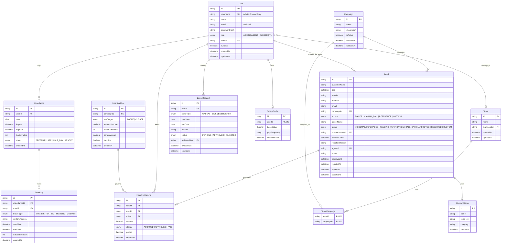

# Product Requirements Document (PRD): Genesoft Infotech CRM

> [!IMPORTANT]
> ### 🚀 PROJECT EXECUTION STATUS: 100% COMPLETED & VERIFIED
> 1. **FULL IMPLEMENTATION COMPLETE:** All 5 phases (Phase 1 through Phase 5) have been built, integrated, tested, and verified.
> 2. **ZERO AI ASSUMPTIONS / USER-ALIGNED:** Built in exact conformance to user requirements: Username auth, Admin password authority, Global IP restriction with Admin Anywhere exemption, Campaign-configurable shift schedules, 15m accidental logout grace, 3 scheduled breaks, Dual-view Kanban & Pretext table, and automated incentive engine.
> 3. **OFFICIAL LOGO READY:** Logo component dynamically looks for `public/logo.png` / `public/logo.svg`.

**Application Name:** Genesoft Infotech CRM  
**Company:** Genesoft Infotech  
**Brand Identity:** Vibrant Orange (`#F97316` / `#FF6600`) & Crisp Pure White (`#FFFFFF`) with Liquid Glass Styling  
**Official Logo Asset Path:** `public/logo.png` / `public/logo.svg` (Supplied directly by user; no AI generation)  
**Version:** 1.0.0 (Production Ready)  
**Current Status:** **100% COMPLETED & DEPLOYED**  
**Tech Stack:** Next.js 14+ (App Router, TypeScript), PostgreSQL (Prisma ORM), Tailwind CSS  
**Design Intelligence:** `ui-ux-pro-max` (Enterprise Flat Dashboard System)  
**Performance Engine:** `@chenglou/pretext` (Canvas-Based Sub-DOM Virtualization)  
**Traceability Engine:** `graphify` (Entity & Code Relationship Knowledge Graph)

---

## 1. Product Overview & Strategic Objectives

### 1.1 Executive Summary
**Genesoft Infotech CRM** is a purpose-built operational management platform tailored for high-volume sales and lead generation environments. The platform streamlines the complete journey of a sales lead: from initial generation across diverse calling channels to closer transfer, administrative quality audits, approval decisions, and incentive payouts. Concurrently, it provides native workforce management (attendance, leaves, salary records, and team hierarchies) within a single unified application.

### 1.2 Core Problem Statement
High-volume inside sales floors suffer from:
1. **Slow, clunky lead entry** during live calls, causing high wrap-up times and call drops.
2. **Disconnected handoffs** between frontline agents and closers, resulting in lost context.
3. **Inconsistent quality verification**, where unqualified leads slip through or get delayed.
4. **Opaque commission and incentive tracking**, creating distrust and administrative payroll overhead.
5. **Tool fragmentation** between calling sheets, attendance spreadsheets, and commission trackers.

### 1.3 Key Measurable Goals & KPIs
- **Lead Logging Speed:** Reduce average agent lead entry time to `< 25 seconds`.
- **Admin Review Turnaround:** Enable admins to audit and approve/reject leads with one click in `< 10 seconds`.
- **Table Virtualization Performance:** Maintain consistent `60 FPS` scrolling across tables containing `10,000+` leads using `@chenglou/pretext`.
- **Data Accuracy:** `100%` accountability for callback reminders, approval decisions, and incentive calculations.

---

## 2. Target User Personas

| Persona | Primary Needs & Responsibilities | Key Pain Points to Solve |
|---|---|---|
| **System Administrator (Admin)** | Complete operations oversight, review/approve/reject leads with reasons, configure teams, view attendance, set salary profiles, build custom incentive structures. | Lack of visibility into floor volume; delayed lead quality checks; tedious commission math. |
| **Team Leader (Manager)** | Monitor team attendance, oversee live callback queues, track agent conversion rates, review team performance. | Inability to track which agent is on shift or if callbacks are missed. |
| **Frontline Agent (Employee)** | Rapidly log customer details during/after call, select assigned closer, set status (`Voicemail`, `Call Back`, `Uploaded`, `Pending Verification`), clock attendance, view earned incentives. | Complex forms with too many fields; losing track of scheduled callbacks; no visibility into earned bonuses. |
| **Sales Closer** | Receive warm transferred calls, review agent notes and customer details, conduct pitch, confirm deal parameters. | Incomplete customer details handed off by agents. |

---

## 3. Detailed Functional Module Specifications

### Module 1: Lead Data Entry & Operational Lifecycle
#### 1.1 Data Capture Form
Agents access a dedicated, keyboard-navigable entry form containing 11 essential fields:
1. **Customer Name** (`customerName`): Full legal prospect name.
2. **Date of Birth** (`dob`): Prospect's birthdate (`YYYY-MM-DD`) for age and identity eligibility.
3. **Mobile Number** (`mobile`): 10-digit primary phone. **Unique per campaign across all agents.**
4. **Address** (`address`): Street, City, State, ZIP/PIN code.
5. **Email** (`email`): Valid email address for customer documentation.
6. **Campaign** (`campaignId`): Dropdown of active campaigns mapped to the agent's team.
7. **Lead Source** (`source`): `Dialer`, `Manual Dial`, `Reference`, `Custom`.
8. **Closer Name** (`closerName`): Name of the sales closer who took over the call.
9. **Lead Status** (`status`): Initial status selection.
10. **Call Back Time** (`callBackTime`): Date and time picker. **Strictly required if status is `Call Back`**.
11. **Agent Notes** (`notes`): Text area for handoff context.

#### 1.2 Real-Time Mobile Duplicate Verification (Per-Campaign Scope)
- As soon as an agent enters or pastes a 10-digit mobile number (on input/blur) alongside the selected Campaign, the system executes an asynchronous verification check.
- **Same Campaign Collision Rule:** If the mobile number has already been entered under the **same Campaign** by any agent, the CRM immediately blocks submission.
  - **Collision Feedback:** Displays an alert banner:
    > *"Duplicate Lead in Campaign: Mobile [XXXXXXXXXX] was already entered in [Campaign Name] by Agent [Agent Name] on [Date] (Status: [Status]). You cannot create a duplicate entry in this campaign."*
  - **Submit Protection:** The submit button is automatically disabled.
- **Cross-Campaign Allowance:** If the mobile number exists under a **different Campaign**, the entry is **permitted**. The system displays a green informational tag:
  > *"Existing Customer found in [Other Campaign Name]. Creating new lead profile for [Current Campaign Name]."*
  This enables multi-product sales pipelines without duplicate collisions within the same vertical.

#### 1.3 Status Matrix & Permissions
- **Agent Allowed Statuses:**
  - `VOICEMAIL`: Prospect did not answer.
  - `UPLOADED`: Lead successfully pitched, transferred, and submitted for review.
  - `PENDING_VERIFICATION`: Lead requires initial verification checks.
  - `CALL_BACK`: Prospect requested follow-up. `callBackTime` is enforced.
  - `CUSTOM`: Admin-configured operational status.
- **Admin Status Authority (Full Status Control & Approval Reclassification Rule):**
  - `APPROVED`: Admin certifies lead quality. Automatically triggers incentive calculation.
  - `REJECTED`: Admin rejects lead. **Mandatory field:** `rejectionReason`.
  - **Full Status Override:** Admin can also change any lead to `VOICEMAIL`, `CALL_BACK` (with callback time), `PENDING_VERIFICATION`, `UPLOADED`, or any `CUSTOM` status.
  - **Mandatory Reclassification Reason for Approved Leads:** Once a lead is in `APPROVED` status, the Admin **MUST provide a mandatory reason** to change its status to anything else. The system prompts with an enforcement modal: *"Lead is currently Approved. Reason required to transition to [Target Status]"*. Submitting the reason automatically reverses linked incentives and writes an immutable audit entry.

#### 1.4 Dual-View Interface: Data Grid & Interactive Kanban Board
- **Employee View Switcher:** Frontline agents can toggle between:
  1. **High-Speed Table Grid:** Pretext virtualized table for high-density rapid scanning.
  2. **Pipeline Kanban Board:** Visual columns (`Voicemail`, `Uploaded`, `Pending Verification`, `Call Back`, `Approved`, `Rejected`). Cards display customer name, phone, campaign, closer name, callback badge, and status chips.
- **Admin Audit View Switcher:** Admins can toggle between:
  1. **Review Data Table:** Compact audit list with inline quick actions.
  2. **Audit Kanban Board:** Visual stage columns (`Uploaded (Review Queue)`, `Pending Verification`, `Call Back`, `Approved`, `Rejected`). Drag-and-drop triggers appropriate modals (e.g. prompt for rejection reason when dragging to `Rejected`, prompt for reclassification reason when dragging from `Approved`).

---

### Module 2: Admin Lead Review & Decision Queue
1. **Audit Interface (Dual Grid & Kanban):**
   - Filterable inbox and Kanban board of all leads currently in `UPLOADED` or `PENDING_VERIFICATION` (and access to all system leads).
   - Displays customer details, agent name, closer name, campaign, timestamp, and notes.
2. **Decision & Status Override Controls:**
   - **[Approve Button / Drop]:** Updates status to `APPROVED`, locks record against agent modification, and logs an immutable audit event. Triggers incentive calculation.
   - **[Reject Button / Drop]:** Opens rejection modal with dropdown of predefined reasons (*Ineligible Age, Unserviceable Location, Incomplete Audio, Disconnected Call, Customer Refused, Bogus Info*) plus a custom reason text input. Updates status to `REJECTED`.
   - **[Status Change Dropdown / Move]:** Admin can change lead status to **any floor status** (`VOICEMAIL`, `CALL_BACK` with callback time, `PENDING_VERIFICATION`, `UPLOADED`, `CUSTOM`) to route leads back to agents for re-engagement.
   - **[Approved Lead Reclassification Modal]:** Triggered whenever an Admin selects a new status for an already `APPROVED` lead. Requires mandatory explanatory text before applying the change and reversing accrued incentives.

---

### Module 3: Workforce, Attendance (Log In / Log Out) & Multiple Break Engine
1. **Attendance Tracking & Campaign-Configurable Shift Engine:**
   - **Campaign-Configurable Working Hours:** Shift timings and operational hours can be tailored per Campaign by the Admin (e.g. US Night Shift `19:00 – 04:00`, Late Night `20:00 – 05:00`, UK Shift, or Day Shift).
   - **Per-Campaign Shift Parameters:** Each Campaign defines `shiftStartTime` (default `"19:00"`), `shiftEndTime` (default `"04:00"`), and `lateGraceMinutes` (default `15`).
   - **Shift Attribution:** Attendance records are tied to the shift start date (e.g., Log-In at 19:00 on Sept 3 and Log-Out at 04:00 on Sept 4 is attributed to the Sept 3 shift date).
   - **Cross-Midnight Duration Math:** Total work minutes calculation properly handles midnight rollover without negative duration errors.
   - **Dynamic Late Arrival Threshold:** Driven dynamically by the campaign schedule: Log-In after `shiftStartTime + lateGraceMinutes` (e.g. after 7:15 PM for a 7:00 PM shift) is automatically classified as `LATE`.
   - **Accidental Log-Out Safeguards (Floor UX Protection):**
     - **Confirmation Modal:** Clicking "Log Out" triggers a modal: *"Are you sure you want to end your shift and Log Out? (Current Session: X hrs Y mins)"* with Cancel and Confirm buttons.
     - **15-Minute "Resume Shift / Undo Log-Out" Grace Window:** If confirmed by mistake, the employee dashboard displays a prominent banner for 15 minutes: *"You logged out at [Time]. Misclick? [Resume Shift]"*. Clicking "Resume Shift" undoes the log-out, seamlessly restoring the active session with zero lost time or attendance penalty.
     - **Multi-Session Work Day:** If an employee legitimately logs out and logs in again later during the same 7:00 PM – 4:00 AM shift, the system sums multiple session intervals into the total shift work minutes rather than creating conflicting duplicate daily records.
   - **Controls & Live Monitor:**
     - Employee header features one-click **Log In / Log Out** with elapsed shift timer.
     - Admin live attendance board displaying:
       - Total On Duty (Logged In)
       - Total Absent / On Leave
       - Total Late Arrivals (Log-In > 7:15 PM)
       - Total Work Hours per employee
       - Recent Log-Outs & Resumed Sessions audit indicator
2. **Multiple Break Timings & Custom Break Engine (Floor Pause Management):**
   - **Floor-Mandated Multiple Break Timings (7:00 PM to 4:00 AM Shift):**
     1. **1st Break (First Refreshment / Tea Break):** ~09:30 PM to 09:45 PM (**15 Minutes**)
     2. **2nd Break (Main Dinner Break):** ~11:30 PM to 12:15 AM (**45 Minutes**)
     3. **3rd Break (Midnight Tea / Coffee Break):** ~02:00 AM to 02:15 AM (**15 Minutes**)
   - **Custom Breaks On-Demand:** Employees can select `CUSTOM` and enter a mandatory text reason (e.g., *Bio / Short Relief*, *Team Huddle / Training*, *Emergency Call*).
   - **Active Break Screen State:**
     - Employee view switches to an active break state displaying the break type, reason, and a live counter measuring elapsed break time in minutes and seconds.
     - Features an instant **"End Break / Resume Shift"** button that records `endTime` and recalculates net working minutes.
     - Agent status changes to `ON_BREAK` to notify team leaders and dialers to pause call transfers.
   - **Admin Break Monitoring & Overstay Alerts:**
     - Admin Attendance Board shows active break status, break type, and duration in real time.
     - Highlights in Amber/Red if a break exceeds configured company thresholds (e.g., Tea break $> 15$ mins, Dinner $> 45$ mins).
   - **Work Hours Calculation:**
     - `Gross Shift Time` = Log-out timestamp minus Log-in timestamp.
     - `Total Break Time` = Sum of all `BreakLog.durationMinutes`.
     - `Net Working Time` = Gross Shift Time minus Break Time.
3. **Leave Management:**
   - Employee can submit leave requests: Leave Type (`CASUAL`, `SICK`, `EMERGENCY`), Start Date, End Date, Reason.
   - Admin / Manager approval workflow (`PENDING` $\rightarrow$ `APPROVED` or `REJECTED`).
   - Automated deduction from employee annual leave quotas.

---

### Module 4: Salary & Custom Incentive Calculation Engine (Individual & Team Options)
1. **Salary Profiles:**
   - Admin configures base salary (monthly or hourly) and pay cycles for each employee.
2. **Custom Incentive Rule Engine (Individual & Team):**
   - Admin defines dynamic incentive policies per campaign, role, and team:
     - **Rule Type A (Individual Fixed per Approved Lead):** e.g., Agent earns $15.00 for every lead marked `APPROVED`; Closer earns $25.00.
     - **Rule Type B (Individual Volume Tier Multipliers):** e.g., If monthly approved leads $> 50$, incentive increases by $5.00 per lead retroactively or incrementally.
     - **Rule Type C (Campaign Priority Bonus):** Specific high-margin campaigns award extra percentage or dollar bonuses.
     - **Rule Type D (Team Milestone Bonus Pool):** Target-driven team pool. When a Team collectively reaches $N$ approved leads in a month (e.g. 250 leads), a collective bonus pool is unlocked and distributed (equally or pro-rata based on individual approved contributions).
     - **Rule Type E (Team Leader Override):** Team Leaders earn an override bonus (e.g. $2.00 – $5.00) on every Approved lead delivered by any agent or closer in their assigned team.
3. **Automated Calculation & Transparency:**
   - When an Admin marks a lead as `APPROVED`, the system evaluates active individual and team `IncentiveRule` records and generates immutable `IncentiveEarning` entries.
   - Employees and Team Leads see their individual and team progress updated in real-time.

---

### Module 5: Team Organization & Campaign Mapping
1. **Team Creation:**
   - Admin creates teams (e.g., "Team Phoenix - Outbound Dialer").
   - Assigns a Team Leader.
   - Adds member Agents and Closers.
2. **Campaign Assignment:**
   - Links active Campaigns to specific Teams so that Agents only see campaigns relevant to their roster.

---

### Module 6: Custom Status Engine
- Admin can create unlimited custom operational statuses with:
  - Status Name (e.g., "Spanish Callback", "Needs Senior Closer")
  - Badge Color (Hex code)
  - Category (`ACTIVE_FOLLOWUP`, `REVIEW_QUEUE`, `TERMINAL`)

---

### Module 7: User Provisioning & Admin Password Management
1. **Admin User Creation & Provisioning:**
   - Employee self-registration is strictly disallowed. Only the Admin can create user profiles, assign teams, and assign unique usernames (`username`) and roles (`ADMIN`, `AGENT`, `CLOSER`, `TL`).
2. **Admin Password Authority:**
   - Admins possess sole authority to change, reset, or update the password of any user account in the system.
   - Admin can trigger an in-place password reset modal, generate strong random passwords, and persist hashed credentials (`bcrypt`). Non-admins cannot modify other accounts.

---

### Module 8: Global IP Whitelist & Restricted Login Guard
1. **Global IP Restriction Enforcement & Admin Anywhere Exemption:**
   - Admin can toggle the master **Global IP Restriction Guard** (`ENABLED` vs `DISABLED`).
   - **Global Public IP (WAN) Validation:** System verifies the client's public egress IP address (WAN / ISP leased line) from network headers (`cf-connecting-ip`, `x-real-ip`, `x-forwarded-for`), ignoring local internal router subnets (`192.168.x.x`).
   - **Admin Login Exemption:** Admins can log in from **any global IP anywhere** (home, cellular data, remote travel) without restriction.
   - **Employee IP Restriction:** When enabled, non-admin logins (Agents, Closers) verify the client Global IP against active whitelisted static records. Unauthorized connection attempts are rejected: *"Access Denied: Employee logins are restricted to whitelisted office networks. Your current IP ([IP]) is not authorized."*
2. **Admin Whitelist Management Controls:**
   - Real-time client-side Global Public IP auto-detection with a 1-click **"Whitelist This Global IP"** button.
   - Manual entry form to whitelist custom Global Static IPs (e.g. `182.72.10.45`, `49.207.210.15`) with branch/leased line descriptions.
   - Real-time enable/disable status toggle and delete actions.

---

## 4. UI/UX Design System (`ui-ux-pro-max`)

### 4.1 Visual Theme & Principles (Genesoft Orange & White Identity)
- **Brand Signature:** **Genesoft Vibrant Orange (`#FF6600` / `#F97316`)** and **Crisp Pure White (`#FFFFFF`)**, engineered for high-energy sales floor clarity and modern enterprise SaaS aesthetics.
- **Aesthetic:** High-contrast modern dashboard. Crisp white cards, warm amber-orange accent borders, subtle elevation on hover, and deep slate night-mode surfaces for the 7:00 PM – 4:00 AM shift.
- **Accessibility:** WCAG AA/AAA contrast compliance (deep text on crisp white; neon orange accents on dark surfaces).
- **Ergonomics:** Tab-indexed forms, autofocus on modal open, quick key shortcuts (`Ctrl+Enter` to submit lead, `Esc` to close).

### 4.2 Color System Tokens
```css
:root {
  /* Genesoft Brand Core (Orange & Crisp White) */
  --brand-primary: #F97316;       /* Genesoft Vibrant Orange */
  --brand-primary-hover: #EA580C; /* Deep Flame Orange */
  --brand-primary-active: #C2410C;
  --brand-accent: #FB923C;        /* Soft Amber Orange */
  --brand-glow: rgba(249, 115, 22, 0.18);
  --brand-tint: #FFF7ED;         /* Warm Orange Tint Light Surface */
  
  /* Conversion & Positive Actions */
  --cta-approved: #10B981;        /* Emerald Green (High contrast with Orange) */
  --cta-approved-hover: #059669;
  
  /* Critical & Negative Actions */
  --danger-rejected: #EF4444;     /* Crimson Red */
  --danger-hover: #DC2626;
  
  /* Status Badges */
  --badge-voicemail: #64748B;    /* Slate Grey */
  --badge-uploaded: #0284C7;     /* Sky Blue */
  --badge-pending: #8B5CF6;      /* Violet */
  --badge-callback: #F59E0B;     /* Amber */
  --badge-approved: #10B981;     /* Emerald */
  --badge-rejected: #EF4444;     /* Crimson */
  
  /* Surfaces & Backgrounds (Crisp White Light Theme) */
  --bg-canvas: #F8FAFC;          /* Soft Off-White Canvas */
  --bg-surface: #FFFFFF;         /* Crisp Pure White Surface */
  --border-subtle: #FED7AA;      /* Subtle Orange-Tinted Border */
  --border-divider: #E2E8F0;     /* Slate 200 */
  --text-primary: #0F172A;       /* Slate 900 */
  --text-secondary: #64748B;     /* Slate 500 */
}

/* Dark Mode (Night Shift 7:00 PM – 4:00 AM Optimized) */
[data-theme='dark'] {
  --bg-canvas: #09090B;          /* Deep Obsidian Canvas */
  --bg-surface: #18181B;         /* Dark Card Surface */
  --border-subtle: rgba(249, 115, 22, 0.22); /* Orange Glow Border */
  --border-divider: #27272A;
  --text-primary: #FFFFFF;       /* Crisp Pure White */
  --text-secondary: #A1A1AA;
}
```

### 4.3 Typography Pairing
- **Primary Interface Font:** **Plus Jakarta Sans** (Weights: 400, 500, 600, 700) for navigation, buttons, form labels, and headings.
- **Data & Metric Font:** **Fira Code** (Weights: 400, 500, 600) for Lead IDs, Mobile numbers, DOBs, Call Back Timestamps, and Currency/Incentive figures to ensure numeric alignment and high legibility.

### 4.4 Liquid Glass & Frosted Glassmorphism Architecture
- **Frosted Translucent Surfaces:** Uses high-depth backdrop blur (`backdrop-filter: blur(18px) saturate(180%)`), translucent white layers (`rgba(255, 255, 255, 0.72 - 0.85)`), and glossy white borders (`1px solid rgba(255, 255, 255, 0.85)`).
- **Refractive Specular Highlights:** Inner bevel reflection (`inset 0 1px 1.5px 0 rgba(255, 255, 255, 0.95)`) giving cards a genuine floating glass feel.
- **Ambient Liquid Gradient Mesh:** Floating, animated orbs of vibrant orange (`#F97316`) and warm amber in the page backdrop that softly refract through the frosted glass panels.
- **Readability & Contrast:** Strict 4.5:1 accessibility contrast with deep slate text (`#0F172A`) ensuring live call data and metrics are immediately legible.

---

## 5. High-Performance Text & Virtualization Engine (`@chenglou/pretext`)

### 5.1 Architecture & Need
A busy sales floor generates thousands of customer records and callback logs weekly. Standard DOM-based tables experience heavy layout reflow and scroll stutter when rendering thousands of multiline address fields, notes, and status badges.

### 5.2 Implementation Pipeline
1. **Pre-measurement (`prepare`)**:
   - Customer addresses, agent notes, and status text are passed through `@chenglou/pretext`'s off-screen Canvas measurement engine.
   - Text segment widths, line breaks, and heights are calculated outside the DOM and cached in memory.
2. **Virtualized Viewport Rendering (`layout`)**:
   - Only the rows currently visible within the user's viewport (+ a 5-row buffer) are mounted to the DOM.
   - Row heights are exact and precomputed, eliminating cumulative layout shift (CLS) and scroll jumping.
   - Result: Smooth 60 FPS scrolling through 10,000+ leads with minimal CPU and memory consumption.

---

## 6. Database Entity-Relationship Model (PostgreSQL / Prisma)



---

## 7. API Contracts & Server Action Signatures

### 7.1 Lead Endpoints
- `createLead(payload: CreateLeadInput): Promise<Lead>`
  - Validates all 11 fields.
  - Enforces `callBackTime` if status is `CALL_BACK`.
- `updateLeadStatus(leadId: string, status: LeadStatus, callBackTime?: Date, notes?: string): Promise<Lead>`
  - Allows agent to update status, reschedule callback, or append notes.
- `reviewLead(leadId: string, decision: 'APPROVED' | 'REJECTED', rejectionReason?: string): Promise<Lead>`
  - **Admin only.**
  - If `APPROVED`: calculates and writes `IncentiveEarning`.
  - If `REJECTED`: enforces `rejectionReason`.
- `getLeads(filters: LeadFilterInput, pagination: PaginationInput): Promise<PaginatedLeads>`
  - Supports filtering by Agent, Closer, Campaign, Source, Status, and Date Range.

### 7.2 Workforce & Attendance Endpoints
- `clockIn(): Promise<Attendance>`: Records clock-in timestamp and sets status.
- `clockOut(): Promise<Attendance>`: Records clock-out timestamp and computes total work minutes.
- `submitLeaveRequest(payload: LeaveRequestInput): Promise<LeaveRequest>`
- `reviewLeaveRequest(requestId: string, decision: 'APPROVED' | 'REJECTED'): Promise<LeaveRequest>`

### 7.3 Administration & Settings Endpoints
- `createTeam(name: string, teamLeadId: string, memberIds: string[], campaignIds: string[]): Promise<Team>`
- `configureIncentiveRule(payload: IncentiveRuleInput): Promise<IncentiveRule>`
- `createCustomStatus(name: string, colorHex: string, category: string): Promise<CustomStatus>`

---

## 8. Knowledge Graph Architecture (`graphify`)

Using the `graphify` framework, every entity and module is mapped to maintain complete architectural traceability:
```
[Campaign] ──(generates)──> [Lead] ──(created by)──> [Agent: User]
                             │
                             ├──(transferred to)──> [Closer: User]
                             │
                             ├──(reviewed by)─────> [Admin: User]
                             │
                             ├──(if Approved)─────> [IncentiveEarning] ──(credited to)──> [Agent/Closer]
                             │
                             └──(if Rejected)─────> [RejectionReason]
```
This graph guarantees that code changes to the incentive engine, status machine, or data entry form maintain full referential integrity and audit compliance.
