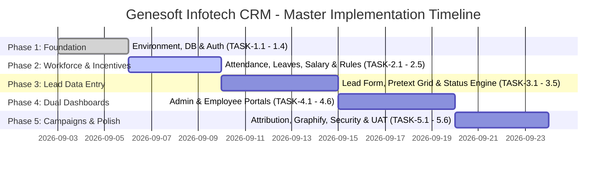

# Master Tasks & Execution Plan: Genesoft Infotech CRM

> [!WARNING]
> ### 🛑 EXECUTION FREEZE — STRICT PLANNING PHASE ONLY:
> **DO NOT BEGIN ANY TASK EXECUTION OR IMPLEMENTATION.**
> 1. All tasks outlined below are strictly on hold until the user gives explicit, final instruction to proceed.
> 2. **NO AI ASSUMPTIONS:** The AI assistant MUST NOT invent, guess, or create any fields, data, or logic independently. All requirements and parameters must come directly from the user.
> 3. **OFFICIAL LOGO GOVERNANCE:** The official company logo will be provided directly by the user (at `public/logo.png` / `public/logo.svg`). The AI assistant MUST NOT generate or create any mock or artificial logo.

**Project:** Genesoft Infotech CRM  
**Brand Theme:** Vibrant Orange (`#F97316`) & Crisp White (`#FFFFFF`)  
**Official Logo Asset:** `public/logo.png` / `public/logo.svg` (To be supplied directly by user)  
**Current Execution State:** **FROZEN — STRICT PLANNING & DESIGN REVIEW IN PROGRESS**  
**Phase Execution Strategy:** Strict Phase-Gated Delivery (No phase commences until user explicitly commands start)  
**Total Phases:** 5 Chronological Phases  
**Total Work Packages:** 26 Atomic Tasks  

---

## Phase Overview & Execution Roadmap

---

## Phase 1: Foundation, Data Architecture & Authentication

### TASK-1.1: Project Scaffolding & Environment Setup
- **Component:** Core Infrastructure
- **Description:** Initialize Next.js 14+ (App Router, TypeScript) workspace, configure ESLint, Prettier, PostCSS, and path aliases (`@/*`).
- **Dependencies:** None
- **Mapped Requirements:** `REQ-SEC-001`
- **Definition of Done (DoD):** Clean Next.js project boots locally on `npm run dev`, TypeScript compiles with 0 errors.

### TASK-1.2: Database Modeling & Prisma Configuration
- **Component:** Data Layer
- **Description:** Implement PostgreSQL schema via Prisma. Define `User`, `Team`, `Campaign`, `Lead`, `CustomStatus`, `Attendance`, `LeaveRequest`, `SalaryProfile`, `IncentiveRule`, and `IncentiveEarning` models with foreign keys, indexes, and cascades.
- **Dependencies:** `TASK-1.1`
- **Mapped Requirements:** `REQ-DATA-001` - `006`, `REQ-HR-001`, `REQ-INC-001`
- **Definition of Done (DoD):** `npx prisma migrate dev` runs successfully, database tables and indexes verified via Prisma Studio.

### TASK-1.3: Design System Tokens & Typography Configuration (`ui-ux-pro-max`)
- **Component:** Frontend Architecture
- **Description:** Configure Tailwind CSS with Genesoft Infotech's brand tokens: Vibrant Orange primary (`#F97316` / `#FF6600`), Crisp Pure White (`#FFFFFF`) card surfaces, warm amber highlights, Emerald CTA (`#10B981`), deep obsidian night-mode surfaces (`#09090B`), and standardized status badge colors. Import Google Fonts **Plus Jakarta Sans** and **Fira Code**.
- **Dependencies:** `TASK-1.1`
- **Mapped Requirements:** `REQ-UI-001`, `REQ-UI-002`, `REQ-UI-003`, `REQ-UI-004`
- **Definition of Done (DoD):** Tailwind config defines brand color scales (`brand-50` through `brand-700`), custom typography classes, and utility tokens; demo page validates color contrast and font loading.

### TASK-1.4: Role-Based Authentication & Session Management
- **Component:** Security / Auth
- **Description:** Implement authentication using NextAuth.js / JWT session cookies with bcrypt password hashing. Create role guards supporting `ADMIN` and `EMPLOYEE` access levels. Seed default Genesoft Infotech Admin user.
- **Dependencies:** `TASK-1.2`, `TASK-1.3`
- **Mapped Requirements:** `REQ-SEC-001` - `003`, `REQ-DASH-001`
- **Definition of Done (DoD):** User can log in; role-based middleware redirects Admins to `/admin` and Employees to `/dashboard`; unauthorized routes return 403.

---

## Phase 2: Workforce, Attendance, Salary & Custom Incentive Engine

### TASK-2.1: Attendance, Multiple Breaks & Log In / Log Out Engine (7 PM – 4 AM Shift, Misclick Protection & Scheduled Breaks)
- **Component:** HR / Workforce
- **Description:** Implement Server Actions and client components for one-click **Log In** and **Log Out** calibrated for the company's **7:00 PM to 4:00 AM** night shift. Implement **Accidental Log-Out Protection**: confirmation prompt modal, 15-minute "Resume Shift / Undo Log-Out" banner that merges active sessions with zero lost time, and multi-session daily work time aggregation. Build **Multiple Break Engine**: Scheduled break windows (1st Tea Break: 15m at 9:30 PM, Dinner: 45m at 11:30 PM, Midnight Tea: 15m at 2:00 AM) and `CUSTOM` break reasons, live break timer, and "End Break" button. Calculate gross shift hours, total break duration, and net productive work minutes across the midnight boundary, attribute attendance to the shift start date, and assign status (`PRESENT`, `ON_BREAK`, `LATE` if after 7:15 PM, `HALF_DAY`).
- **Dependencies:** `TASK-1.2`, `TASK-1.4`
- **Mapped Requirements:** `REQ-HR-001`, `REQ-HR-002`, `REQ-HR-006`, `REQ-HR-007`, `REQ-HR-008`, `REQ-HR-009`, `REQ-HR-010`
- **Definition of Done (DoD):** Employee can log in/log out for the 7 PM - 4 AM shift; handles midnight rollover without negative duration errors; confirms log-out via modal; provides 15-minute resume shift window; supports 3 scheduled break windows + custom breaks with live timer; logs BreakLog entries; computes net work hours; creates shift-attributed attendance row in database.

### TASK-2.2: Leave Request Submission & Review System
- **Component:** HR / Workforce
- **Description:** Create employee leave request modal (`CASUAL`, `SICK`, `EMERGENCY`) and Admin/Manager review dashboard with Approve/Reject actions.
- **Dependencies:** `TASK-2.1`
- **Mapped Requirements:** `REQ-HR-004`, `REQ-HR-005`
- **Definition of Done (DoD):** Employee submits leave request; Admin sees request and can approve/reject; status updates immediately in DB.

### TASK-2.3: Employee Salary Profile Master
- **Component:** HR / Payroll
- **Description:** Create Admin interface to view and edit employee base salary, pay frequency, and compensation effective dates.
- **Dependencies:** `TASK-1.2`, `TASK-1.4`
- **Mapped Requirements:** `REQ-INC-001`
- **Definition of Done (DoD):** Admin can view and update salary records per employee; data persisted securely.

### TASK-2.4: Custom Incentive Rule Engine & Calculator (Individual & Team Options)
- **Component:** Financial / Incentive
- **Description:** Build dynamic incentive policy builder allowing Admin to define payouts per `Approved` lead based on role (`AGENT` vs `CLOSER`), campaign, and **Team Incentive Options** (collective milestone pools for teams, member splits, and Team Leader override commissions). Implement trigger listener that calculates and records `IncentiveEarning` entries when a lead transitions to `Approved`.
- **Dependencies:** `TASK-1.2`, `TASK-2.3`
- **Mapped Requirements:** `REQ-INC-002`, `REQ-INC-003`, `REQ-INC-005`, `REQ-INC-006`, `REQ-INC-007`
- **Definition of Done (DoD):** Transitioning a test lead to `Approved` automatically generates accurate `IncentiveEarning` records for agent, closer, team leader overrides, and updates team target milestone progress.

### TASK-2.5: Team Creation & Hierarchy Manager
- **Component:** Operations / Organization
- **Description:** Build Admin team management interface: Create team name, assign Team Leader, assign Agents/Closers, and map associated Campaigns.
- **Dependencies:** `TASK-1.2`, `TASK-1.4`
- **Mapped Requirements:** `REQ-TEAM-001` - `003`
- **Definition of Done (DoD):** Admin can create teams, add members, and assign campaigns; relations persist and filter correctly.

---

## Phase 3: Lead Data Entry Engine & Status Machine

### TASK-3.1: Streamlined Agent Lead Data Entry Form
- **Component:** Lead Capture
- **Description:** Build high-speed, keyboard-accessible modal/form capturing all 11 fields: Customer Name, DOB, Mobile, Address, Email, Campaign, Source, Closer Name, Status, Call Back Time (conditional), and Notes.
- **Dependencies:** `TASK-1.3`, `TASK-1.4`
- **Mapped Requirements:** `REQ-DATA-001` - `006`, `REQ-STAT-001`
- **Definition of Done (DoD):** Agent can enter all fields and submit via `Ctrl+Enter` in `< 25 seconds`; form enforces required fields and valid formats.

### TASK-3.2: Campaign-Scoped Mobile Validation & Duplicate Prevention
- **Component:** Validation & Data Integrity
- **Description:** Implement real-time asynchronous mobile verification on input/blur scoped by Campaign. Query the database to ensure the 10-digit mobile number does not already exist within the selected Campaign. If a collision is detected within the same campaign, display a duplicate warning with the original agent's details and disable submission. If the mobile exists in a different campaign, permit entry and display an informative cross-campaign badge.
- **Dependencies:** `TASK-3.1`
- **Mapped Requirements:** `REQ-DATA-004`
- **Definition of Done (DoD):** Enforces composite `(mobile, campaignId)` uniqueness; blocks duplicate entry within the same campaign across agents; allows entry for the same customer in different campaigns; passes unit tests.

### TASK-3.3: Status State Machine & Callback Enforcement
- **Component:** Lead Pipeline
- **Description:** Implement status lifecycle logic. Enforce mandatory `callBackTime` when status is `CALL_BACK`. Prevent agents from selecting `Approved` or `Rejected`.
- **Dependencies:** `TASK-3.1`
- **Mapped Requirements:** `REQ-STAT-001`, `REQ-STAT-002`, `REQ-STAT-003`
- **Definition of Done (DoD):** Selecting `Call Back` renders mandatory date-time picker; form blocks submit if omitted; agent UI cannot select `Approved`/`Rejected`.

### TASK-3.4: Custom Status Builder & Tagging Engine
- **Component:** Operations / Customization
- **Description:** Implement Admin interface to create custom operational statuses with name, color hex badge, and operational category.
- **Dependencies:** `TASK-1.2`, `TASK-3.3`
- **Mapped Requirements:** `REQ-STAT-001`, `REQ-UI-002`
- **Definition of Done (DoD):** Admin-created custom statuses immediately appear in the Agent status dropdown with correct color styling.

### TASK-3.5: Canvas-Based Text Measurement Integration (`@chenglou/pretext`)
- **Component:** Performance Engine
- **Description:** Integrate `@chenglou/pretext` to measure customer addresses, agent notes, and status labels off the DOM using HTML Canvas. Compute exact row heights ahead of table layout.
- **Dependencies:** `TASK-1.1`, `TASK-3.1`
- **Mapped Requirements:** `REQ-PERF-001`, `REQ-PERF-003`
- **Definition of Done (DoD):** Text layout calculations execute in sub-millisecond time outside the DOM; returns verified row height metrics.

---

## Phase 4: Dual Dashboards & Virtualized Workspaces

### TASK-4.1: Admin Dual-View Review Queue (Table & Kanban), Decisions & Approved Lead Reclassification
- **Component:** Admin Portal
- **Description:** Build Admin audit workspace with seamless 1-click toggling between **Data Grid Table** and an **Interactive Kanban Board** (columns: `Uploaded`, `Pending Verification`, `Call Back`, `Approved`, `Rejected`). Implement one-click **[Approve]** action and **[Reject]** modal with mandatory rejection reason. Build **Full Status Override Selector / Drag-and-Drop** allowing Admin to reassign any lead to `Voicemail`, `Call Back` (with callback time), `Pending Verification`, `Uploaded`, or `Custom Status`. Build **Approved Lead Reclassification Modal**: if modifying an already `Approved` lead (via dropdown or dragging out of Approved), strictly enforce a mandatory reason, reverse/void linked incentive earnings, and log an immutable audit event.
- **Dependencies:** `TASK-2.4`, `TASK-3.3`
- **Mapped Requirements:** `REQ-REV-001` - `007`, `REQ-STAT-003`, `REQ-STAT-004`, `REQ-DASH-006`, `REQ-DASH-007`
- **Definition of Done (DoD):** Admin can toggle between Table and Kanban views; approve leads in 1 click or drag (triggers incentive); rejecting requires reason; modifying an Approved lead requires mandatory reason and auto-reverses incentives; Admin can reassign status to Voicemail, Call Back, etc.; logs audit events.

### TASK-4.2: Audit Trail & Status History Log
- **Component:** Compliance / Audit
- **Description:** Build timeline component displaying complete audit history of status changes, reviewer names, reasons, and timestamps.
- **Dependencies:** `TASK-4.1`
- **Mapped Requirements:** `REQ-REV-004`
- **Definition of Done (DoD):** Every status transition generates an audit entry; visible in lead details drawer.

### TASK-4.3: Admin Workforce & Attendance Monitor Board (Log In / Log Out)
- **Component:** Admin Portal
- **Description:** Build real-time Admin attendance oversight board showing active logged-in employees, late arrivals (log-in > 7:15 PM), staff on scheduled breaks (1st Tea, Dinner, Midnight Tea, Custom), and total net productive work hours.
- **Dependencies:** `TASK-2.1`, `TASK-2.2`
- **Mapped Requirements:** `REQ-HR-003`, `REQ-DASH-002`, `REQ-HR-010`
- **Definition of Done (DoD):** Real-time board reflects current employee log-in status and active break timers accurately.

### TASK-4.4: Employee Dual-View Workspace ("My Leads" Table & Pipeline Kanban)
- **Component:** Employee Portal
- **Description:** Build Employee dashboard featuring: minimal stat strip (`Today's Leads`, `Callbacks`, `Incentives`), 1-click switcher between **Pretext Virtualized Table** and **Pipeline Kanban Board** (columns: `Voicemail`, `Uploaded`, `Pending Verification`, `Call Back`, `Approved`, `Rejected`), in-place edit actions, and clean centered Fast Lead Entry modal (`Ctrl+N`).
- **Dependencies:** `TASK-3.1`, `TASK-3.3`
- **Mapped Requirements:** `REQ-DASH-003`, `REQ-DASH-004`, `REQ-DASH-006`, `REQ-DASH-007`
- **Definition of Done (DoD):** Logged-in employee can switch seamlessly between Table and Kanban views; sees only their leads; can update status and notes directly.

### TASK-4.5: Employee Incentive & Commission Tracker UI
- **Component:** Employee Portal
- **Description:** Build transparent earnings widget on employee dashboard displaying total approved leads, itemized incentive credits per lead, and projected monthly payout.
- **Dependencies:** `TASK-2.4`, `TASK-4.4`
- **Mapped Requirements:** `REQ-INC-004`
- **Definition of Done (DoD):** Widget updates in real-time when Admin approves an employee's lead, showing exact dollar amounts.

### TASK-4.6: Pretext-Powered 60 FPS Virtualized Table Engine
- **Component:** Performance / UI
- **Description:** Combine `@chenglou/pretext` row metrics with viewport virtualization (`@tanstack/react-virtual` or custom windowing) to render 10,000+ leads with 60 FPS scrolling and zero layout shifts.
- **Dependencies:** `TASK-3.5`, `TASK-4.4`
- **Mapped Requirements:** `REQ-PERF-002`, `REQ-PERF-003`
- **Definition of Done (DoD):** Table with 10,000 mocked leads scrolls at consistent 60 FPS with zero DOM lag or layout reflow.

---

## Phase 5: Campaign Management, Analytics, Testing & Knowledge Graph

### TASK-5.1: Campaign Management & Source Attribution
- **Component:** Marketing & Analytics
- **Description:** Build Admin campaign management interface (create, activate, pause campaigns; set target quotas and date ranges). Ensure lead counts link to active campaigns.
- **Dependencies:** `TASK-2.5`, `TASK-3.1`
- **Mapped Requirements:** `REQ-TEAM-002`, `REQ-DATA-007`
- **Definition of Done (DoD):** Admin can create and toggle campaigns; lead source metrics reflect accurate counts.

### TASK-5.2: Operational Floor Analytics & Funnel Reports
- **Component:** Business Intelligence
- **Description:** Implement visual analytics cards using `ui-ux-pro-max` dashboard specifications: Conversion Funnel (Dialed $\rightarrow$ Uploaded $\rightarrow$ Approved), Rejection Reason Breakdown, and Agent Leaderboard.
- **Dependencies:** `TASK-4.1`, `TASK-5.1`
- **Mapped Requirements:** `REQ-DASH-002`
- **Definition of Done (DoD):** Analytics dashboard visualizes conversion rates, top performing agents, and top rejection reasons accurately.

### TASK-5.3: Security Audit & Role Boundary Verification
- **Component:** Security
- **Description:** Perform security testing: Validate that Employees cannot invoke Admin Server Actions, cannot access `/admin`, and cannot tamper with incentive records or lead approval statuses.
- **Dependencies:** `TASK-1.4`, `TASK-4.1`
- **Mapped Requirements:** `REQ-SEC-002`, `REQ-SEC-003`
- **Definition of Done (DoD):** Automated tests confirm 100% authorization blocking on restricted endpoints.

### TASK-5.4: Automated Unit & Integration Testing Suite
- **Component:** Quality Assurance
- **Description:** Author Jest / Vitest unit tests for: Lead validation, duplicate mobile check, status transition rules, callback validation, and incentive calculation math.
- **Dependencies:** `TASK-3.3`, `TASK-4.1`
- **Mapped Requirements:** All core requirements
- **Definition of Done (DoD):** Test suite achieves $> 90\%$ coverage across business logic and state machine transitions.

### TASK-5.5: Knowledge Graph Generation & Modularity Mapping (`graphify`)
- **Component:** Architecture & Documentation
- **Description:** Execute `graphify` on the completed codebase to produce relationship knowledge graph, verify module boundaries, and generate interactive architecture report.
- **Dependencies:** `TASK-5.1` - `5.4`
- **Mapped Requirements:** Architecture governance
- **Definition of Done (DoD):** `/graphify .` generates clean knowledge graph and `GRAPH_REPORT.md` confirming zero circular dependencies.

### TASK-5.6: Production Deployment & Onboarding Handbook
- **Component:** DevOps & Handoff
- **Description:** Configure Dockerfile / Vercel deployment configuration, generate production seed data (Genesoft Infotech sample teams, campaigns, and admins), and compile operator guide.
- **Dependencies:** `TASK-5.5`
- **Mapped Requirements:** Production Readiness
- **Definition of Done (DoD):** System builds cleanly for production (`npm run build`), seeds cleanly, and is ready for live floor operations.
